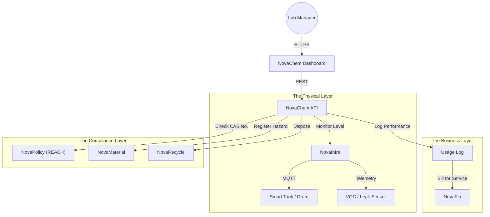

# 🧪 NovaChem

> **The Operating System for Green Chemistry.**
> Management of Chemical Leasing models, hazardous material tracking, and molecular circularity.

[](https://www.google.com/search?q=https://github.com/novaeco-tech/novachem/actions)
[](https://opensource.org/licenses/MIT)
[](https://www.google.com/search?q=https://chemicals.novaeco.tech)

**NovaChem** is the Vertical Sector responsible for the **Molecular Layer** of the economy. While `NovaMaterial` tracks solid parts, **NovaChem** tracks liquids, gases, and compounds. It digitizes the supply chain of solvents, coatings, and reagents to enable **Chemical Leasing** and ensure closed-loop recovery.

It acts as the compliance engine for **REACH** (Registration, Evaluation, Authorisation and Restriction of Chemicals) and the tracking of **PFAS** (Forever Chemicals).

-----

## 🎯 Value Proposition

The chemical industry traditionally profits from selling *more* chemicals. **NovaChem** inverts this incentive structure via **Chemical Leasing**:

1.  **Servitization:** Instead of buying 1,000L of solvent, a factory pays for "1,000 cleaned parts." The supplier retains ownership of the chemical and is incentivized to recover and recycle it.
2.  **Safety & Traceability:** Real-time tracking of hazardous drums via IoT to prevent illegal dumping or accidental leaks.
3.  **Green Substitution:** Using `NovaMind` to suggest non-toxic, bio-based alternatives for industrial processes.

-----

## 🏗️ Architecture (The Molecular Loop)

NovaChem acts as a specialized ERP for hazardous materials. It integrates heavily with `NovaInfra` for tank telemetry and `NovaFin` for performance-based billing.



### Integrated Services

  * **[NovaFin](https://www.google.com/search?q=https://finance.novaeco.tech):** The leasing engine. Calculates the bill based on *performance* (e.g., "Hours of Coating") rather than *volume* delivered.
  * **[NovaInfra](https://www.google.com/search?q=https://infrastructure.novaeco.tech):** Monitors "Smart Drums" equipped with level sensors and GPS. It triggers an alert if a drum moves outside a geofenced safety zone.
  * **[NovaPolicy](https://www.google.com/search?q=https://compliance.novaeco.tech):** The regulator. Checks every transaction against the "Substances of Very High Concern" (SVHC) list to ensure legal compliance.
  * **[NovaRecycle](https://www.google.com/search?q=https://recycling.novaeco.tech):** The end-of-life handler. When a solvent is "spent," NovaChem generates the waste transfer note for NovaRecycle to distill and purify it.

-----

## ✨ Key Features

### 1\. The Chemical Leasing Engine

Changes the unit of transaction.

  * **Traditional:** Invoice = 500 Liters @ €2.00/L.
  * **NovaChem:** Invoice = 500 m² Painted Surface @ €0.50/m².
  * **Result:** The supplier optimizes the process to use *less* paint, reducing waste and cost.

### 2\. Digital Chemical Passports

Detailed composition tracking.

  * Stores the **CAS Number** (Chemical Abstracts Service) and **GHS** (Globally Harmonized System) hazard codes.
  * Propagates this safety data downstream to `NovaTextile` or `NovaMake` so they know exactly what chemistry is in their products.

### 3\. The "Forever Chemical" Watchdog

Automated PFAS tracking.

  * Flags any inventory batch containing restricted per- and polyfluoroalkyl substances.
  * Generates a mandatory report for EU regulators regarding usage and containment.

### 4\. Smart Inventory (VMI)

Vendor Managed Inventory via IoT.

  * Sensors report tank levels in real-time.
  * **Auto-Replenishment:** Triggers a refill order via `NovaTrade` *before* the tank runs dry, optimizing logistics.

-----

## 🚀 Getting Started

We use **DevContainers** to provide a consistent development environment.

### Prerequisites

  * Docker Desktop
  * VS Code (with Remote Containers extension)

### Installation

1.  **Clone the repo:**
    ```bash
    git clone https://github.com/novaeco-tech/novachem.git
    cd novachem
    ```
2.  **Open in VS Code:**
      * Run `code .`
      * Click **"Reopen in Container"** when prompted.
3.  **Start the Sector:**
    ```bash
    make dev
    ```
      * **Dashboard:** http://localhost:3000
      * **API:** http://localhost:8000/docs

### Configuration (`.env`)

```ini
# Compliance Config
REGULATORY_REGION=EU_REACH # or US_TSCA
TRACK_PFAS_STRICT=true

# Integrations
NOVAFIN_URL=http://novafin-api:8000
NOVAINFRA_URL=http://novainfra-api:8000
NOVAPOLICY_URL=http://novapolicy-api:8000
```

-----

## 📂 Repository Structure

This is a Monorepo containing the sector's specific logic.

```text
novachem/
├── api/                # Python/FastAPI (Domain Logic)
│   ├── src/
│   │   ├── leasing/    # Performance-based billing logic
│   │   ├── safety/     # GHS/CAS lookup & compatibility checks
│   │   └── inventory/  # IoT-driven stock management
├── app/                # React/Next.js Frontend (Lab Dashboard)
│   ├── src/
│   │   ├── tanks/      # Visualizers for fluid levels
│   │   └── sds/        # Safety Data Sheet viewer
├── website/            # Documentation (Docusaurus)
└── tests/              # Integration tests
```

-----

## 🧪 Testing

We use **Process Simulation** for testing.

  * **Leasing Logic:** `make test-lease`
      * Simulates a cleaning process where volume usage drops by 10%. Asserts that the supplier's margin increases (proving the incentive works).
  * **Safety Test:** `make test-hazard`
      * Attempts to mix "Oxidizer" and "Flammable" in the same storage zone. Asserts that the API blocks the allocation and triggers a Safety Alert.

-----

## 🤝 Contributing

We need contributors with backgrounds in **Chemical Engineering**, **Toxicology**, and **Supply Chain Logistics**.
See [CONTRIBUTING.md](https://www.google.com/search?q=../.github/CONTRIBUTING.md) for details.

**Maintainers:** `@novaeco-tech/maintainers-sector-novachem`